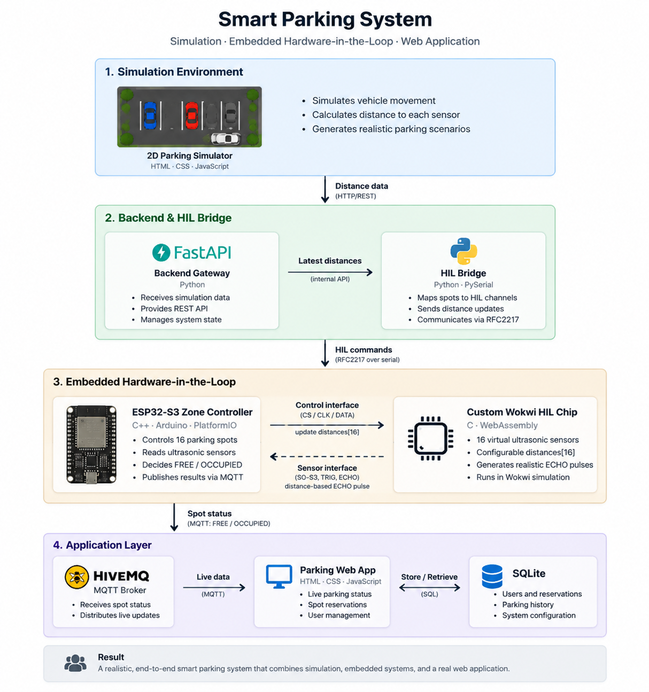
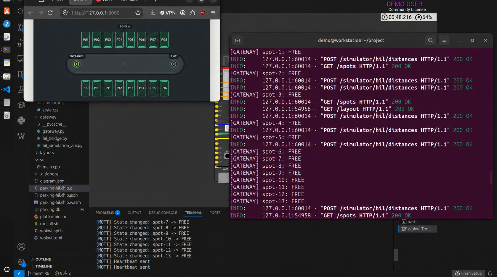
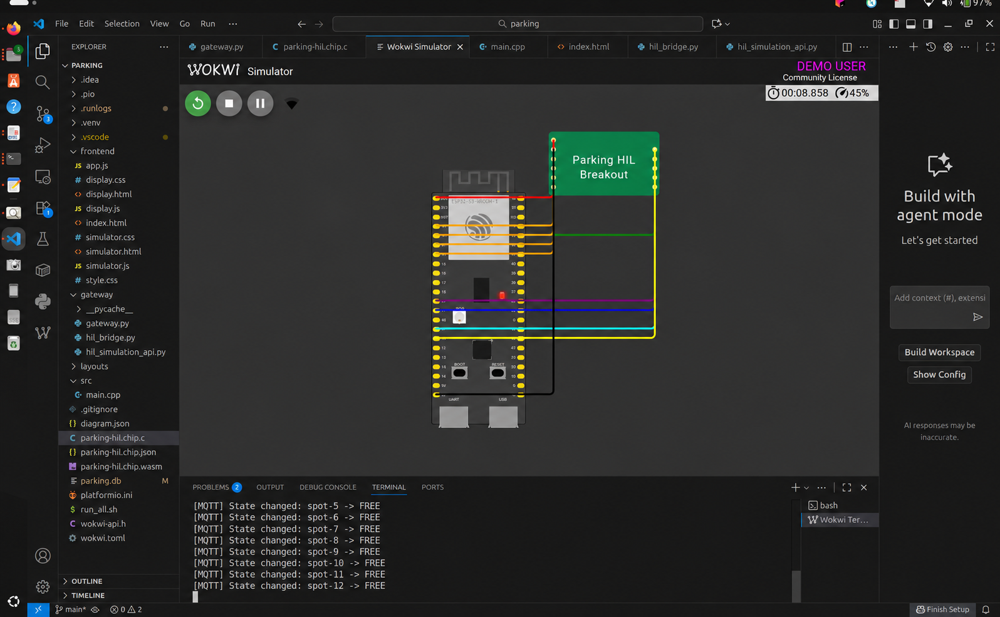
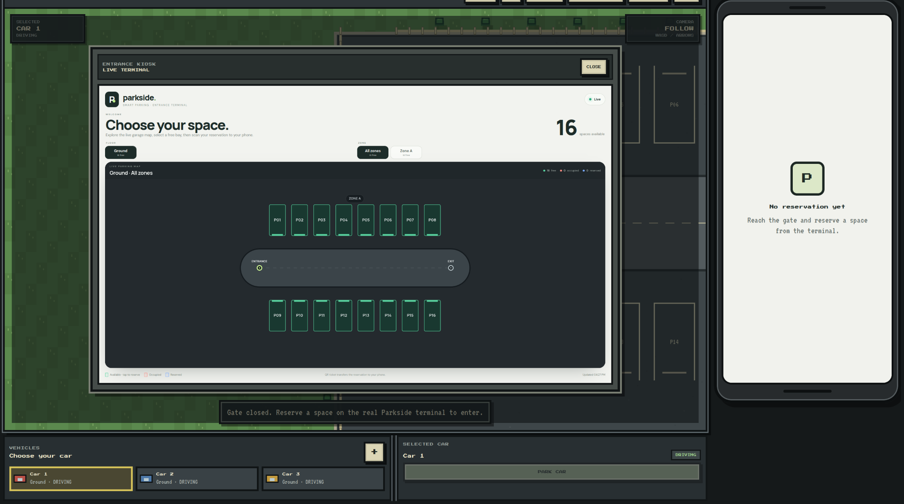
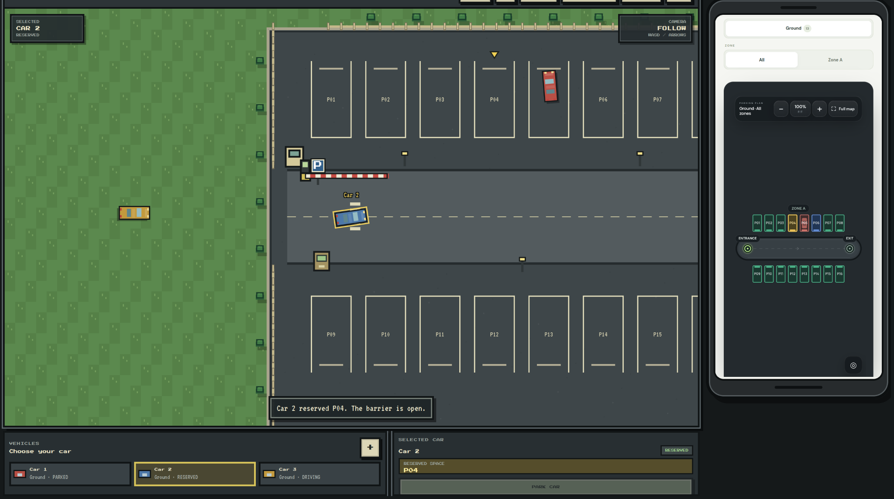
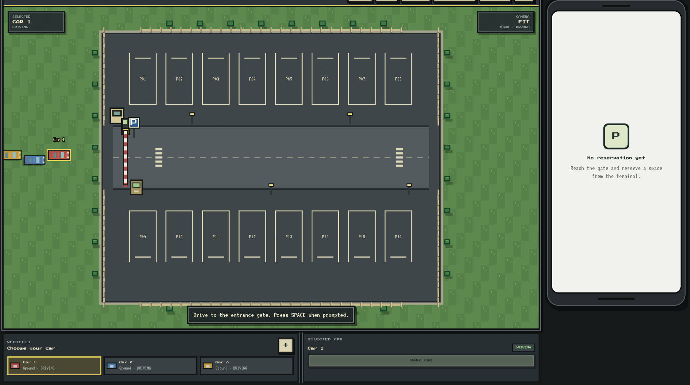
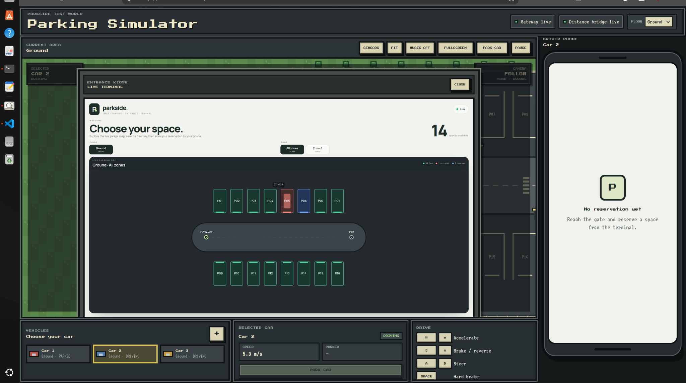
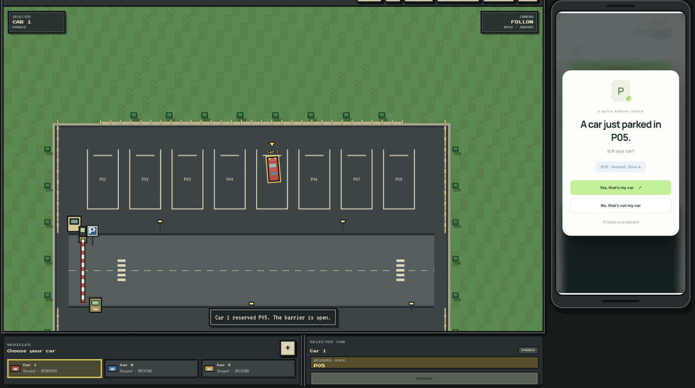
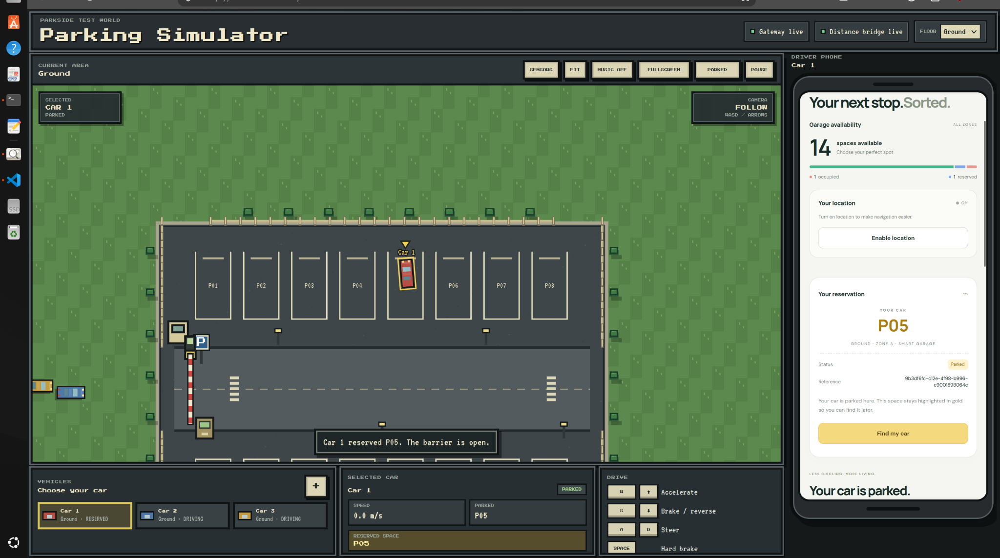

# Smart Parking Hardware-in-the-Loop Demo

An end-to-end smart-parking prototype that connects a browser-based driving simulator to a simulated ESP32-S3 controller, sixteen virtual ultrasonic sensors, an MQTT telemetry path, and reservation-focused web interfaces.

The project is more than a parking-map mock-up: vehicle positions in the 2D simulator become distance measurements, those measurements travel through a Hardware-in-the-Loop (HIL) bridge, and the ESP32 firmware makes the final `FREE`/`OCCUPIED` decision before publishing it back to the application.



## What the demo includes

- A 2D parking simulator with drivable cars, collision-aware movement, barriers, parking sensors, and a phone preview.
- A configurable 16-space garage loaded from JSON.
- A FastAPI gateway that serves all three web interfaces and the REST API.
- A custom Wokwi WebAssembly chip that emulates 16 multiplexed HC-SR04-style ultrasonic sensors.
- ESP32-S3 firmware with hysteresis, sensor-fault handling, state confirmation, Wi-Fi, and MQTT publishing.
- A driver view for availability, reservations, navigation, and arrival confirmation.
- An entrance display that creates one-time QR reservation tickets.
- SQLite persistence for spot and reservation state.

| Interface | URL | Purpose |
| --- | --- | --- |
| Driver application | `http://127.0.0.1:8000/` | View availability, manage a reservation, and confirm a parked car |
| Entrance display | `http://127.0.0.1:8000/display` | Select a free bay and transfer the reservation by QR code |
| Parking simulator | `http://127.0.0.1:8000/simulator` | Drive test vehicles and generate virtual sensor distances |
| OpenAPI documentation | `http://127.0.0.1:8000/docs` | Explore and call the FastAPI endpoints |

## How the HIL loop works

1. The simulator computes the distance from each parking sensor to the nearest vehicle and posts a frame to `POST /simulator/hil/distances`.
2. `gateway/hil_bridge.py` reads the latest frame and sends changed channels over Wokwi's RFC2217 serial server on port `4000`.
3. The ESP32 receives each `channel,distance` update and forwards a 24-bit control packet to the custom Wokwi chip.
4. When the ESP32 triggers a selected sensor, the custom chip produces an ECHO pulse whose width represents that channel's distance.
5. The firmware classifies the bay using an occupied threshold below `80 cm`, a free threshold above `100 cm`, and three consecutive confirmations to reduce chatter.
6. Confirmed state and sensor-health messages are published through MQTT.
7. The FastAPI gateway subscribes to the MQTT feed, persists state in SQLite, and exposes it to the web applications.

This separation is intentional: the browser only generates physical distance inputs. It does not decide whether a space is free or occupied; that decision remains in the embedded firmware.



## Architecture and source map

| Path | Responsibility |
| --- | --- |
| `frontend/simulator.html`, `simulator.js`, `simulator.css` | 2D vehicle simulation and distance-frame generation |
| `frontend/index.html`, `app.js`, `style.css` | Driver-facing parking and reservation application |
| `frontend/display.html`, `display.js`, `display.css` | Entrance kiosk and QR ticket flow |
| `gateway/gateway.py` | FastAPI routes, MQTT subscriber, reservation logic, and SQLite persistence |
| `gateway/hil_simulation_api.py` | In-memory handoff for the latest simulator distance frame |
| `gateway/hil_bridge.py` | HTTP-to-RFC2217 distance bridge and MCU log reader |
| `src/main.cpp` | ESP32-S3 sensor scanning, filtering, health checks, and MQTT publishing |
| `parking-hil.chip.c` | Custom Wokwi chip implementing the control bus and ultrasonic ECHO timing |
| `diagram.json`, `parking-hil.chip.json`, `wokwi.toml` | Wokwi board, custom-chip, and RFC2217 configuration |
| `layouts/parking_layout.json` | Floors, zones, bays, aisle graph, entrance, and exit |
| `parking.db` | Demo SQLite state used by the gateway |
| `run_all.sh` | Build and startup orchestration |

## Requirements

The included startup script targets Linux and expects these commands to be available:

- Python 3 with `venv`
- PlatformIO CLI (`pio`)
- Wokwi CLI (`wokwi-cli`)
- Visual Studio Code (`code`) with the Wokwi extension
- A browser opener compatible with `xdg-open`
- Internet access for Wokwi, the public MQTT broker, and the QR-code JavaScript CDN

The Python packages used by the gateway and bridge are `fastapi`, `uvicorn`, `paho-mqtt`, `pyserial`, and `requests`.

## Quick start

### 1. Clone the repository

```bash
git clone https://github.com/rasleneboukhari-stack/smart-parking-hil.git
cd smart-parking-hil
```

### 2. Create the expected Python environment

`run_all.sh` deliberately uses a project-local `.venv`:

```bash
python3 -m venv .venv
.venv/bin/python -m pip install --upgrade pip
.venv/bin/python -m pip install fastapi uvicorn paho-mqtt pyserial requests
```

### 3. Start the stack

```bash
chmod +x run_all.sh
./run_all.sh
```

The script will:

1. Compile `parking-hil.chip.c` into `parking-hil.chip.wasm`.
2. Build the ESP32 firmware with PlatformIO.
3. Start the FastAPI gateway on port `8000`.
4. Open the driver application and simulator in the browser.
5. Open the project in VS Code.
6. Wait for a real RFC2217 connection from Wokwi.
7. Start the HIL bridge after the Wokwi handshake succeeds.

### 4. Start Wokwi when prompted

In VS Code:

1. Open the Command Palette with `Ctrl+Shift+P`.
2. Run **Wokwi: Start Simulator**.
3. Keep the Wokwi simulator running while using the browser simulator.

The terminal will print `PARKING STACK RUNNING` after the RFC2217 connection is ready. Press `Ctrl+C` in the `run_all.sh` terminal to stop the gateway and HIL bridge.



## Using the demo

1. Open the simulator and drive a car to the entrance.
2. Open the entrance display, choose an available space, and create a reservation.
3. Scan the QR ticket with a device that can reach the gateway, or open the generated claim URL in another browser tab.
4. Drive the selected car into its reserved bay.
5. Wait for the ESP32 sensor pipeline to mark the bay occupied.
6. Confirm whether the detected car is yours. The application can also move or cancel an active reservation and handle a car parked in another occupied bay.

The reservation state machine uses:

```text
ACTIVE -> AWAITING_CONFIRMATION -> COMPLETED
   |               |
   +-> CANCELLED   +-> ACTIVE (if the bay becomes free again)
   |
   +-> EXPIRED after 5 minutes
```





## REST API summary

| Method | Endpoint | Description |
| --- | --- | --- |
| `GET` | `/layout` | Return the configured garage geometry and navigation graph |
| `GET` | `/spots` | Return physical, effective, reservation, floor, and zone state |
| `POST` | `/reserve` | Reserve an available spot |
| `GET` | `/reservation/{id}` | Read a reservation's current state |
| `POST` | `/reservation/{id}/confirm` | Confirm the detected car in the reserved bay |
| `POST` | `/reservation/{id}/move` | Move a waiting reservation to another free bay |
| `POST` | `/reservation/{id}/parked-elsewhere` | Associate the reservation with another occupied bay |
| `POST` | `/reservation/{id}/cancel` | Cancel an active reservation |
| `POST` | `/display/reserve` | Reserve from the kiosk and create a one-time claim token |
| `GET` | `/claim/{token}` | Transfer the reservation into browser local storage |
| `POST` | `/simulator/hil/distances` | Accept the latest simulator distance frame |
| `GET` | `/simulator/hil/distances` | Return the latest frame to the HIL bridge |

Example:

```bash
curl http://127.0.0.1:8000/spots

curl -X POST http://127.0.0.1:8000/reserve \
  -H 'Content-Type: application/json' \
  -d '{"spot_id":"spot-5"}'
```

## Configuration

### Parking layout

Edit `layouts/parking_layout.json` to change garage geometry, labels, floors, zones, and navigation. The current HIL firmware and custom chip are fixed at 16 channels, so increasing the number of physical HIL bays also requires corresponding firmware and bridge changes.

### Ports and services

| Service | Default |
| --- | --- |
| FastAPI gateway | `0.0.0.0:8000` |
| Wokwi RFC2217 server | `127.0.0.1:4000` |
| MQTT broker | `broker.hivemq.com:1883` |
| ESP32 simulation Wi-Fi | `Wokwi-GUEST` |

The MQTT namespace is currently hard-coded in both `src/main.cpp` and `gateway/gateway.py`. Change it in both files before running multiple copies or sharing a public broker with other users.

### Important timing values

- The browser attempts to send a fresh distance frame every `100 ms`.
- The HIL bridge sends channels that changed by at least `0.25 cm` and performs a full refresh every `3 s`.
- The ESP32 scans one sensor every `60 ms`.
- Reservations expire after `300 s`.
- A zone is considered offline after `15 s` without a heartbeat.

## Logs and troubleshooting

Runtime logs are stored in `.runlogs/`:

- `.runlogs/gateway.log`
- `.runlogs/hil_bridge.log`

### The script waits forever for RFC2217

Wokwi has not opened the server configured in `wokwi.toml`. Start the simulator from the VS Code Wokwi extension and confirm that port `4000` is not already in use.

### The HIL bridge reports no simulator distances

Open `http://127.0.0.1:8000/simulator`. The browser simulator is the component that posts distance frames to the gateway.

### The web page loads but status does not update

Check all three links in the chain:

1. The browser simulator shows **Distance bridge live**.
2. `.runlogs/hil_bridge.log` shows communication with the MCU.
3. `.runlogs/gateway.log` shows a successful MQTT connection and spot messages.

### A QR code points to localhost

`localhost` and `127.0.0.1` refer to the device scanning the code, not necessarily the computer running the gateway. Access the entrance display through the host computer's LAN address if a phone must claim the reservation.

### Old state appears after restart

The gateway reloads spot and reservation state from `parking.db`. Keep the database when you want persistence; use a fresh demo database when you need a clean scenario.

## Public-demo and privacy notes

- The included screenshots use anonymized identity and workstation labels.
- The MQTT broker is public and unauthenticated. Do not publish personal, confidential, or production data through this demo configuration.
- The API has no authentication and is intended for local demonstration, not internet exposure.
- Browser geolocation is optional and remains in the browser; indoor routing uses the garage layout graph.
- The tracked SQLite file contains generated demo state and reservation identifiers, not user profiles.

## Additional screenshots

<p align="center">
  
  
</p>

<p align="center">
  
  
</p>

## Scope

This repository is an educational HIL prototype. Before production use, add authentication, an isolated MQTT broker with TLS, input hardening, database migrations, automated tests, deployment configuration, and physical-hardware validation.
