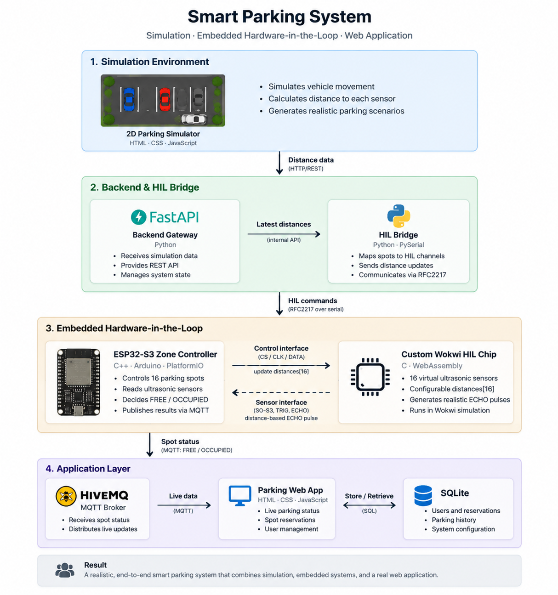

# Smart Parking System - Hardware-in-the-Loop

An end-to-end smart parking platform combining simulation, embedded control, hardware-in-the-loop testing, and a web application.

## Overview

The system simulates parking sensors using a 2D environment, converts virtual distances into hardware sensor behavior, and lets an ESP32-S3 controller determine parking occupancy.

## Main Components

- 2D Parking Simulator (HTML/CSS/JavaScript)
- FastAPI Backend (Python)
- HIL Bridge (Python + PySerial)
- ESP32-S3 Embedded Controller (C++ / PlatformIO)
- Custom Wokwi HIL Chip (C/WebAssembly)
- MQTT Communication (HiveMQ)
- Web Application
- SQLite Storage

## Embedded Concept

The ESP32 does not receive occupancy states directly.

It receives simulated sensor behavior through the HIL environment, measures the virtual ultrasonic echo response, and decides:

- FREE
- OCCUPIED

## Features

- 16 parking spots controlled by one ESP32-S3 zone controller
- Virtual ultrasonic sensor array
- Real-time parking status
- Reservation workflow
- Hardware-in-the-loop validation
